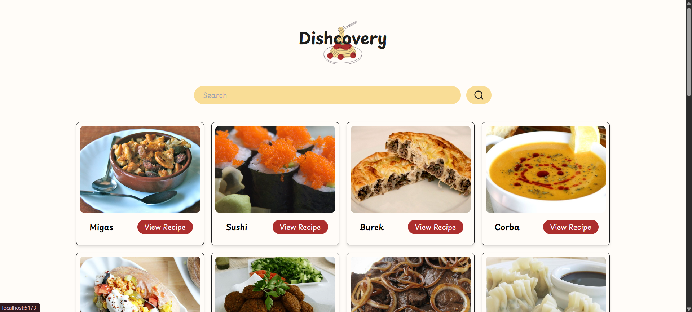

# 🍽️ Dishcovery

Welcome to **Dishcovery**, a fun and fast recipe finder app! Search for delicious recipes by name and explore detailed cooking instructions, ingredients, and categories — all at your fingertips.
Built with **React**, styled with **Tailwind CSS**, and powered by **TheMealDB API.**

---

## 🚀 Features

* 🔎 **Search Recipes** by name
* 🍜 **View Recipe Details** with image, category, ingredients, and instructions
* 🧾 **Responsive Design** for mobile and desktop
* ⚡ **Loading Indicators** using custom GIFs
* ✅ Clean routing using **React Router**

---

## 🛠️ Tech Stack

* **React** – Frontend library
* **React Router** – Routing between pages
* **Tailwind CSS** – Styling with custom themes
* **TheMealDB API** – Free recipe data

---

## 📸 Preview



---

## 🗂️ Project Structure

```
src/
├── App.jsx
├── App.css
├── main.jsx
├── components/
│   ├── SearchBar.jsx
│   ├── RecipeList.jsx
│   ├── RecipeCard.jsx
│   ├── RecipeDetail.jsx
│   ├── Loader.jsx
│   └── ErrorMessage.jsx
```

---

## 🔧 Installation & Setup

1. **Clone the repo:**

   ```bash
   git clone https://github.com/AitijhyaCoded/Dishcovery.git
   cd dishcovery
   ```

2. **Install dependencies:**

   ```bash
   npm install
   ```

3. **Start the development server:**

   ```bash
   npm run dev
   ```

4. Visit [http://localhost:5173](http://localhost:5173) to explore Dishcovery!

---

## 🧑‍🍳 How It Works

* The **Home Page** shows the search bar and recipe list.
* When you search, Dishcovery fetches matching recipes from TheMealDB API.
* Click **View Recipe** to see full details on a separate page using React Router.
* The loader shows a cute animation while data is being fetched.

---

## 📦 API Reference

Using [TheMealDB API](https://www.themealdb.com/api.php)

* Search endpoint: `https://www.themealdb.com/api/json/v1/1/search.php?s=`
* Detail lookup: `https://www.themealdb.com/api/json/v1/1/lookup.php?i={id}`

---

## 🎉 Credits

* Recipes provided by [TheMealDB](https://www.themealdb.com/)
* Icons from [Lucide React](https://lucide.dev/)
* Images and Loaders from [Flaticon](https://www.flaticon.com/)
* Built with love by *Aitijhya* 😸✨

---
